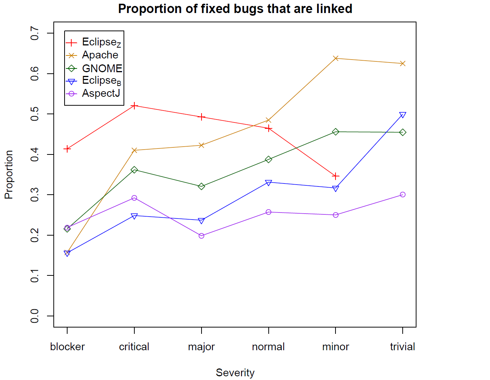

# Bias in data (and something really clever here)

## Anecdote

The 1948 U.S. presidential election proved to be an instrumental even in the ...

As is often the case, many polls were conducted in the run up to the election and the conclusion drawn from these was that the republican New York Governor Thomas Dewey would defeat the presidential incumbent democrat Harry Truman handily.  In fact, the press was so convinced by the ``empirical evidence'' that the Chicago Tribune had already printed the first edition of the paper with the headline "Dewey Defeats Truman" before all election results were in.  Unfortunately for them, the election results the next morning were anything but expected, as Truman had won the electoral vote with 303 votes to Dewey's 189.  A landslide, but in the opposite direction.

  

In the modern era of data collection and statistics, how could such a thing have happened?  The answer lies not in the analysis of the data, but the many biases inherrent in it's collection.  Consider how the polling occurred.  Like today, polling was conducted by randomly selecting and contacting people via telephone.  However, in 1948 telephones were mostly owned by individuals who were more financially well-off and those with higher income levels tended to lean republican.  While the polling was indeed random, the population sampled (people that had telephones) was biased with respect to the entire voting population.

This is interesting, but surely such a mistake couldn't in the 21st century on data drawn from software engineering...

## Impact in SE

Unfortunately bias exists in software engineering data as well.  If left unchecked, this can have disastrous effects.

Bird et al examined defect data sets to determine if there was bias in the links between a defect in the defect database and the corresponding defect correcting change in the source code repository.  Many lines of research, including defect prediction and empirical studies of code quality depend on the ability to "trace" or "link" a defect to the fixing commit.  In four out of five projects, they found that there was bias in the severity level.  That is, the lower the severity level for a fixed bug, the higher the likelihood that there was a link between the defect and the commit.  As an extreme example, while 65% of fixed defects labeled "minor" were able to be linked in Apache, only 15% of those deemed "blocker"s could be linked (see graph for all projects).

  

What's worse is that when they used biased sample set of linked defects to train a defect prediction model, the predictions made by the model were also heavily biased.  Inadvertently using biased data can impact the quality of tools or models and the validity empirical findings.

## Identifying bias

The first step in avoiding the use of biased data is in determining if bias exists in the first place.  This can be done via visualization or statistics.  In the best case scenario, you may have information about the distribution of an important feature in the population.  In the study of defects, we had the severity levels for all fixed bugs in a project.  This was forms our population distribution.  We then compared that to the severity levels for fixed bugs that were linked to commits; our sample distribution.  Generating histograms for the population and sample severity distributions is relatively easy to do in R or Excel and if there is bias, it is often easy to spot visually using such graphs.  One nice aspect of using histograms is that they work for both categorical *and* numerical data.  

Statistically, one can compare distributions of categorical data using a Pearson's chi-squared test or a Fisher's exact test. Both are readily available in any statistical environment such as R, SPSS, or SAS. For numerical data, the Kolmogorov-Smirnov test (also called the K-S test) can tell you if there is a statistically signficant difference between the two populations.  Note that in all of the above cases, the result of the test is a likelihood that the two distributions come from the same population (a so called p-value).  The tests *do not* indicate how the distributions differ (e.g., which way a sample is biased or which category is over-represented).  It is up to you to investigate further and determine what exactly the bias is and how extreme it is.

Unfortunately, you may not always have such exact knowledge about how a feature is distributed in your population.  In the absence of information about the population, distributions from samples expected to be similar could be used.  For instance, if you are examining the number of developers actively contributing to Python over the past year, you could compare the distribution of active developers this year to previous years for Python.  You might also compare it to other projects that you consider to be similar to Python in some way such as Perl or Ruby.  For these types of comparisons, statistical tests are unlikely to provide much value, as the distributions will likely be different to some degree.  A visual inspection will indicate if they are different enough to warrant further investigation.

In those cases, the best approach is to calculate descriptive statistics from your sample, visualize the sample via histograms, pdfs, or boxplots, and make a judgement as to how well the distribution of a feature matches your expectations.

## Assessing Impact

Just because bias exists in a data set does not mean that the bias will have an impact on the results of using the data.  In our study above, we found that when defects used to train a model were biased with respect to severity, the predictions from the model were also biased in a similar way.  However, consider a defect model trained on defects that were fixed mostly (though not completely) on even days of the month (e.g. January 2nd, October 24th, etc.).  While the data is biased with regard to the parity of the fix day, it is unlikely that such a model would do much better when evaluated on defects fixed on even days than on defects fixed on odd days.  

How could we assess the impact of the bias?

If we had access to all defects for all days, that would help.  One could train the model on biased sample and the less biased sample and look at the results to assess impact.  However, usually if we have a biased sample, we don't have access to a larger less biased sample.  One approach is to select subsets of you sample such that they are biased in different ways.  In the above example we could remove any of the odd days so that the model is *only* trained on defects fixed on even days.  Does the performance of this second model differ from the original model?  What about training the model only on days that are multiples of four or ten?  These are "super-biased" data sets. We could go the other way and create a subset from our sample that has the same number of defects fixed on odd and even days.  Does a model trained on this data set perform differently?  If we see (as I suspect we would), that the amount of "day parity" bias does not affect model results, then we may not need to worry about the bias.  If in your investigations, you find that there is a feature (such as age of a developer, size of a commit, or date of a defect report) that is biased and that does effect the results of a study, accuracy of a model, or utility of a technique, you are still not completely out of luck.

## Reporting bias

## Mitigation Strategies

What should you do if you see that there is bias.

## References

Papers to look at for more details.

