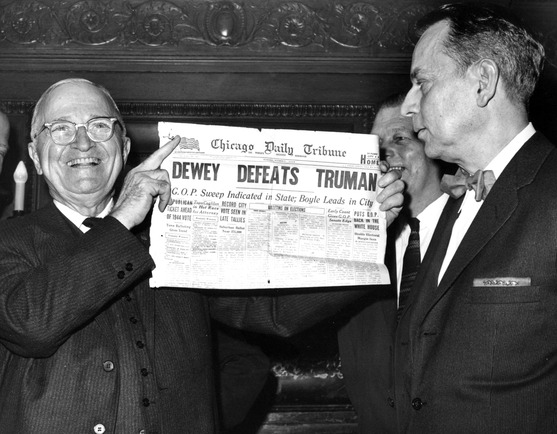

# Bias in data (and something really clever here)

## Anecdote

The 1948 U.S. presidential election proved to be an instrumental even in the ...

As is often the case, many polls were conducted in the run up to the election and the conclusion drawn from these was that the republican New York Governor Thomas Dewey would defeat the presidential incumbent democrat Harry Truman handily.  In fact, the press was so convinced by the ``empirical evidence'' that the Chicago Tribune had already printed the first edition of the paper with the headline "Dewey Defeats Truman" before all election results were in.  Unfortunately for them, the election results the next morning were anything but expected, as Truman had won the electoral vote with 303 votes to Dewey's 189.  A landslide, but in the opposite direction.

  

In the modern era of data collection and statistics, how could such a thing have happened?  The answer lies not in the analysis of the data, but the many biases inherrent in it's collection.  Consider how the polling occurred.  Like today, polling was conducted by randomly selecting and contacting people via telephone.  However, in 1948 telephones were mostly owned by individuals who were more financially well-off and those with higher income levels tended to lean republican.  While the polling was indeed random, the population sampled (people that had telephones) was biased with respect to the entire voting population.

This is interesting, but surely such a mistake couldn't in the 21st century on data drawn from software engineering...

## Impact in SE

Unfortunately bias exists in software engineering data as well.  If left unchecked, this can have disastrous effects.

Bird et al examined defect data sets to determine if there was bias in the links between a defect in the defect database and the corresponding defect correcting change in the source code repository.  Many lines of research, including defect prediction and empirical studies of code quality depend on the ability to "trace" or "link" a defect to the fixing commit.  In four out of five projects, they found that there was bias in the severity level.  That is, the lower the severity level for a fixed bug, the higher the likelihood that there was a link between the defect and the commit.  As an extreme example, while 65% of fixed defects labeled "minor" were able to be linked in Apache, only 15% of those deemed "blocker"s could be linked (see graph for all projects).

  

What's worse is that when they used biased sample set of linked defects to train a defect prediction model, the predictions made by the model were also heavily biased.  Inadvertently using biased data can impact the quality of tools or models and the validity empirical findings.

## Identifying bias

The first step in avoiding the use of biased data is in determining if bias exists in the first place.  This can be done via visualization or statistics.  In the best case scenario, you may have information about the distribution of an important feature in the population.  In the study of defects, we had the severity levels for all fixed bugs in a project.  This was forms our population distribution.  We then compared that to the severity levels for fixed bugs that were linked to commits; our sample distribution.  Generating histograms for the population and sample severity distributions is relatively easy to do in R or Excel and if there is bias, it is often easy to spot visually using such graphs.  One nice aspect of using histograms is that they work for both categorical *and* numerical data.  

Statistically, one can compare distributions of categorical data using a Pearson's chi-squared test or a Fisher's exact test. Both are readily available in any statistical environment such as R, SPSS, or SAS. For numerical data, the Kolmogorov-Smirnov test (also called the K-S test) can tell you if there is a statistically signficant difference between the two populations.  Note that in all of the above cases, the result of the test is a likelihood that the two distributions come from the same population (a so called p-value).  The tests *do not* indicate how the distributions differ (e.g., which way a sample is biased or which category is over-represented).  It is up to you to investigate further and determine what exactly the bias is and how extreme it is.

Unfortunately, you may not always have such exact knowledge about how a feature is distributed in your population.  In those cases, the best approach is to calculate descriptive statistics from your sample, visualize the sample via histograms, pdfs, or boxplots, and make a judgement about how well the distribution of that feature matches your expectations.

## Reporting bias

How and when should you report bias

## Assessing Impact

How can you tell if bias is impacting your results.

## Mitigation Strategies

What should you do if you see that there is bias.

## References

Papers to look at for more details.

